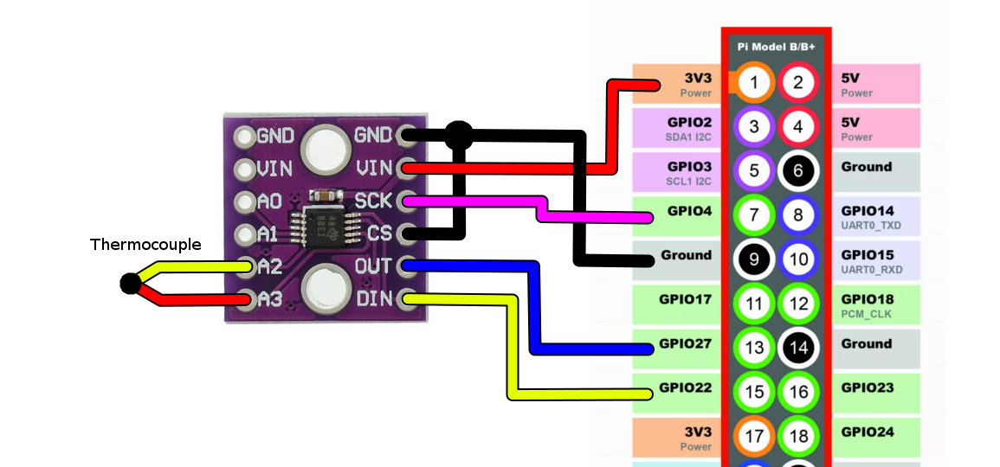
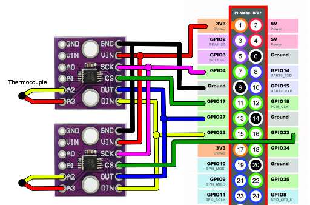
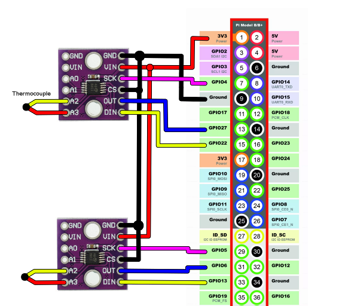

# ADS1118
A python interface to bit bang the ADS1118 chip from a Raspberry Pi. Single shot mode only for now. Also includes a conversion table for type K thermocouples.

The [ADS1118](http://www.ti.com/lit/ds/symlink/ads1118.pdf) uses the SPI protocol. Since the SPI pins on my Raspberry Pi were occupied by the touch screen, this library uses normal GPIO pins instead (ie "bit bang"). 

## Configuration register arguments

This library is only capable of single shot measurements, so `single_shot=True` must be in every config register.

---

The `temp_sensor` argument switches between voltage measurement mode (default) and internal temperature sensor measurement mode. 

---

The `gain` value sets the programmable gain amplifier. This needs to be set higher than the maximum voltage you will need to measure. Note the ADS1118 cannot measure a voltage higher than the input voltage (eg if VIN is supplied with 3.3 V, then the maximum measurement will be 3.3 V). 

| Gain Value | Full Range |
| ------------- | ------------- |
| 0  | ± 6.144 volts  |
| 1  | ± 4.096 |
| 2 (default) | ± 2.048 |
| 3  | ± 1.024 |
| 4  | ± 0.512 |
| 5, 6, 7  | ± 0.256 |

---

The `data_rate` value sets the time it takes to do a single measurement. A faster data rate (more samples per second) increases the noise in each sample. For the highest quality data, choose a low data rate. 


| Data Rate Value | Samples per Second | Time per measurement
| ------------- | ------------- | ------------- |
| 0  | 8  | 125.0 ms
| 1  | 16  | 62.5
| 2  | 32 | 31.3
| 3  | 64  | 15.6
| 4 (default) | 128  | 7.81
| 5  | 250 | 4.00
| 6  | 475  | 2.11
| 7  | 860  | 1.12

---

The `multiplex` argument controls the internal multiplexer, which controls which input is measured. 

| Multiplex Value | Positive | Negative |
| ------------- | ------------- | ------------- |
| 0 (default) | AIN0  | AIN1
| 1  | AIN0 | AIN3
| 2  | AIN1 | AIN3
| 3  | AIN2 | AIN3
| 4  | AIN0 | ground
| 5  | AIN1 | ground
| 6  | AIN2 | ground
| 7  | AIN3 | ground


## Using a single chip

Example use: read and print the temperature from a type K thermocouple connected to A2 and A3. A thermocouple's output voltage is related to the difference in temperature between the two ends of the wire. So in order to convert that to a temperature, the temperature of the "cold junction" (meaning the point where the thermocouple is connected to the measurement device) is needed. We can use the ADS1118's built in high accuracy thermometer for this. This code reads the internal thermometer and the thermocouple voltage once per second, and converts that to a temperature:

```python
#!/usr/bin/env python
# -*- coding: utf-8 -*-
#
# works with python2 or python3

import time
import ADS1118
import typek

# create the config registers
int_temp = ADS1118.encode(single_shot=True, temp_sensor=True, data_rate=5) # internal temperature
tc = ADS1118.encode(single_shot=True, multiplex=3, gain=7, data_rate=5) # thermocouple connected to A2/A3

ads = ADS1118.ADS1118(SCLK=17, DIN=18, DOUT=27) # set the GPIO pins

while True:
    start = time.time()
    ref_temp, tc_voltage = ads.read(int_temp, tc) # read data
    tc_mV = tc_voltage * 1000 # convert to millivolts
    temp = typek.get_temp(ref_temp, tc_mV) # convert to temperature
    print("thermocouple temperature is {:.2f}°C (took {:.4f} ms)".format(temp, (time.time()-start)*1000.))
    time.sleep(1)
```

It would be wired like this:



## Using more than one chip with common data lines
More than one ADS1118 chip can use the data lines if you use a CS line for every chip. The CS line specifies which chip is currently active. Be sure that you don't try to read from more than one chip at a time. 

```python
chip1 = ADS1118.ADS1118(SCLK=4, DOUT=27, DIN=22, CS=17)
chip2 = ADS1118.ADS1118(SCLK=4, DOUT=27, DIN=22, CS=23)
```




## Using more than one chip with independent data lines
You can also assign data lines to each chip. This is useful if you want to read data from both at the same time. 

```python
chip1 = ADS1118.ADS1118(SCLK=4, DOUT=27, DIN=22)
chip2 = ADS1118.ADS1118(SCLK=5, DOUT=6, DIN=13)
```


## Notes
* the datasheet has config variables in binary. i.e. a data rate of 250 SPS is listed as "101", which is 5 in decimal. So you need to use `5` or specify binary with `0b101`. 
* The Raspberry Pi documentation refers to DIN as "MOSI" (master out, slave in) and DOUT as "MISO" (master in, slave out). Other documents may refer to CS as "SS" (slave select). 
* Although the ADS1118 claims it can handle up to 5.5 V, when I tried it the output was mangled. Using 3.3 V power from the Pi fixed that. I assume it has to do with reading 5V TTL logic, so a voltage divider on DOUT may fix that.

## TODO
(help appreciated)
* add continuous mode
* add support for the built in SPI pins

Thanks to the people [on this forum](https://forums.adafruit.com/viewtopic.php?f=19&t=32086&start=15#p372992) for the type K thermocouple linearization code. 
